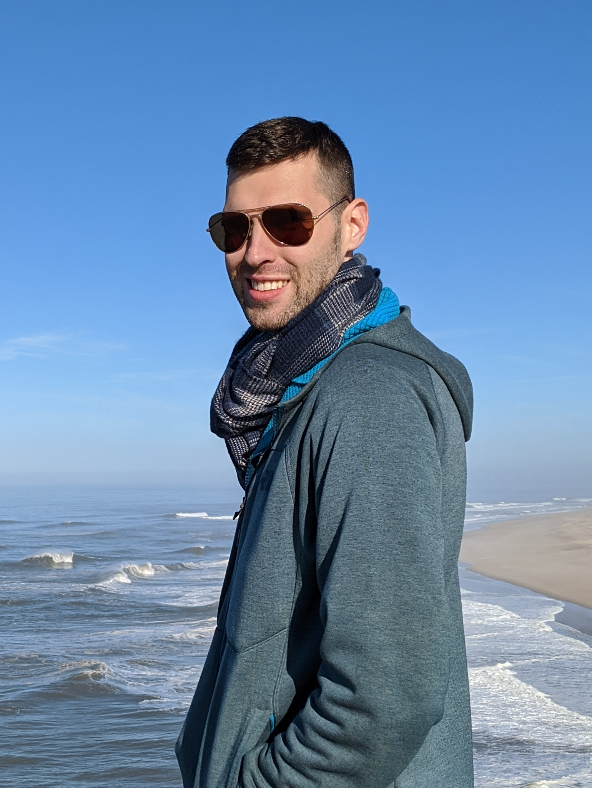

{:height="256px"}

# Summary:

I am a Principal Cybersecurity Research Engineer at BAE Systems with broad interests across the spectrum of security and privacy. 

I received my PhD from the University of Washington's Allen School of Computer Science & Engineering in 2017 where my thesis explored new digital surveillance methods and countermeasures.

# Thoughts:


  <article class="firstlastmiddle">
                    

                                <h2 class="title"><a href="{{ post.url }}" class="js-pjax">{{ post.title }}</a></h2>
                                                               
{{ post.date | date: "%b %d, %Y" }}

                                                                                  
<!--/.article-head-->
                                                                                        

                                                                                               {{ post.long_description }}
  <a href="{{ post.url }}" class="full-post-link js-pjax">Read more</a>
  
<!--/.article-content--></article>
  


  